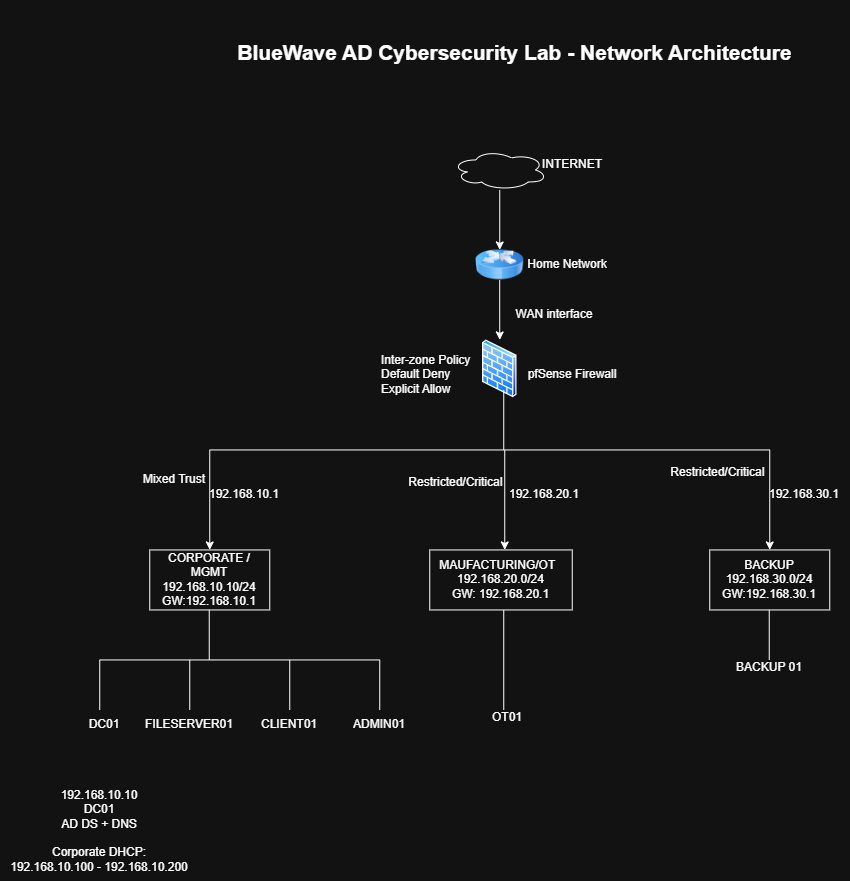

# Lab Architecture Overview

## Overview

The Active Directory Cybersecurity Lab simulates a small Windows enterprise environment for BlueWave Manufacturing.

The environment was built in **Oracle VirtualBox** and uses **pfSense** as the primary network firewall and gateway.

The lab focuses on securing:

* Active Directory;
* privileged access;
* Windows endpoints and servers;
* network communication;
* manufacturing/OT systems; and
* backup infrastructure.

The architecture intentionally separates higher-risk systems into different security zones so that security controls can be implemented and tested.

---
## Network Architecture

The lab is segmented into three security zones using pfSense:

| Security Zone | Subnet | Gateway | Trust Level | Purpose |
|---|---|---|---|---|
| Corporate / Management | `192.168.10.0/24` | `192.168.10.1` | Mixed Trust | AD, servers, administration and corporate endpoints |
| Manufacturing / OT | `192.168.20.0/24` | `192.168.20.1` | Restricted / Critical | Simulated manufacturing environment |
| Backup | `192.168.30.0/24` | `192.168.30.1` | Restricted / Critical | Protected backup and recovery infrastructure |

pfSense acts as the routing and security enforcement point between the three zones.

Inter-zone access follows a **default-deny, explicit-allow** approach. Required communication will be permitted through documented firewall rules and validated through connectivity testing and pfSense logs.
<!--!
## Network Architecture
[Active Directory Cybersecurity Lab Network Architecture](diagrams/network-architecture.png)

The environment uses three internal security zones.

| Security Zone          | Subnet            | Gateway        | Purpose                                                           |
| ---------------------- | ----------------- | -------------- | ----------------------------------------------------------------- |
| Corporate / Management | `192.168.10.0/24` | `192.168.10.1` | Active Directory, servers, administration and corporate endpoints |
| Manufacturing / OT     | `192.168.20.0/24` | `192.168.20.1` | Simulated manufacturing systems                                   |
| Backup                 | `192.168.30.0/24` | `192.168.30.1` | Protected backup and recovery infrastructure                      |

All inter-zone routing is performed by **PFSENSE01**.

-->
---

## Core Systems

| System       | Role                           | Zone                   |
| ------------ | ------------------------------ | ---------------------- |
| PFSENSE01    | Firewall / Router              | Network Boundary       |
| DC01         | Domain Controller / DNS        | Corporate / Management |
| FILESERVER01 | File Server                    | Corporate / Management |
| CLIENT01     | Corporate Workstation          | Corporate / Management |
| ADMIN01      | Administrative Workstation     | Corporate / Management |
| OT01         | Simulated Manufacturing System | Manufacturing / OT     |
| BACKUP01     | Backup Infrastructure          | Backup                 |

Critical infrastructure uses predictable addressing, while standard corporate endpoints can use DHCP.

The Corporate DHCP range is:

`192.168.10.100 – 192.168.10.200`

---

## Security Design Decisions

### Network Segmentation

The OT and Backup environments are separated from the Corporate network using dedicated networks behind pfSense.

This reduces the ability of a compromised corporate workstation to move directly into manufacturing or recovery infrastructure.

The firewall design follows:

> **Default deny between security zones, with required communication explicitly permitted.**

Firewall rules and validation evidence are documented under `07-Network-Security/`.

---

### Active Directory

DC01 provides:

* Active Directory Domain Services;
* domain authentication;
* DNS; and
* Group Policy infrastructure.

Active Directory is treated as critical security infrastructure because compromise of the Domain Controller could provide extensive control over domain identities and Windows systems.

---

### Privileged Administration

Administrative activity is separated from normal user activity through dedicated privileged accounts and the `ADMIN01` administrative workstation.

This reduces exposure of privileged credentials on standard corporate endpoints.

Privileged-access controls are documented under `06-Identity-Security/`.

---

### OT Protection

The Manufacturing / OT environment uses the dedicated:

`192.168.20.0/24`

network.

Corporate systems are not given unrestricted access to the OT environment.

pfSense provides the primary enforcement point between Corporate and OT systems.

---

### Backup Protection

BACKUP01 is placed within the dedicated:

`192.168.30.0/24`

Backup network.

Separating backup infrastructure reduces the likelihood that compromise of a normal corporate endpoint automatically provides access to recovery systems.

This design supports ransomware resilience and recovery protection.

---

## Defence in Depth

The lab does not rely on pfSense alone.

Security controls are implemented across several layers:

| Layer             | Controls                                           |
| ----------------- | -------------------------------------------------- |
| Network           | pfSense, segmentation, firewall rules              |
| Identity          | Active Directory, security groups, least privilege |
| Privileged Access | Separate administrator accounts, ADMIN01           |
| Endpoint          | Windows Firewall, Defender, workstation hardening  |
| Configuration     | Group Policy                                       |
| Detection         | Windows auditing, pfSense logging                  |
| Recovery          | Segmented backup infrastructure                    |
| Assurance         | Security testing, GPResult, PowerShell validation  |

This allows individual security controls to be tested as the project progresses.

---

## Lab Constraint

Because the environment runs in Oracle VirtualBox, the architecture uses three primary security zones rather than separate enterprise VLANs for every system type.

As a result, Domain Controllers, servers, administrative systems and corporate endpoints currently share the Corporate / Management network.

This limitation is mitigated in the lab using:

* Windows Firewall;
* Group Policy hardening;
* least privilege;
* privileged-account separation; and
* endpoint/server security controls.

A production environment would normally implement more granular network segmentation.

See [`../01-Planning/Lab-Limitations.md`](../01-Planning/Lab-Limitations.md) for documented lab constraints.

---

## Security Validation

The architecture will be validated throughout the project rather than relying only on configuration screenshots.

Examples include:

* Corporate-to-OT connectivity testing;
* Corporate-to-Backup connectivity testing;
* firewall rule validation;
* standard-user versus privileged-user access tests;
* GPO validation using GPResult;
* DNS validation;
* Windows security-event analysis; and
* PowerShell security checks.

Test results and evidence are maintained under:

`10-Security-Validation/`

and:

`13-Evidence/`

---

## Production Considerations

A production implementation would consider additional controls such as:

* dedicated Domain Controller network;
* separate server and workstation VLANs;
* dedicated management network;
* guest isolation;
* multiple Domain Controllers;
* MFA;
* privileged access management;
* centralised SIEM;
* EDR/XDR;
* enterprise vulnerability management; and
* resilient backup infrastructure.

These enhancements are outside the current home-lab scope but are considered when evaluating residual risk.
